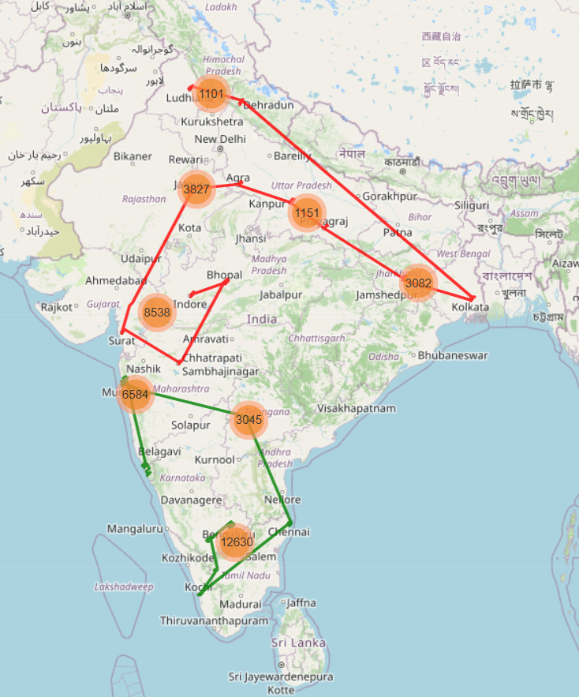
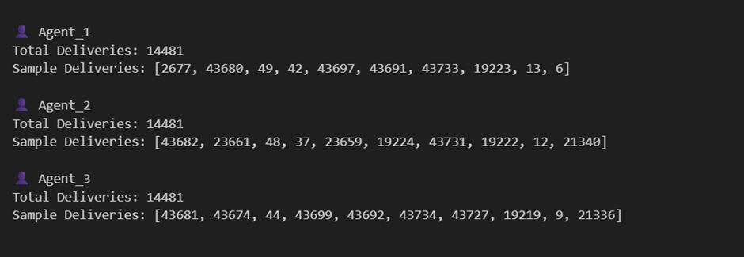
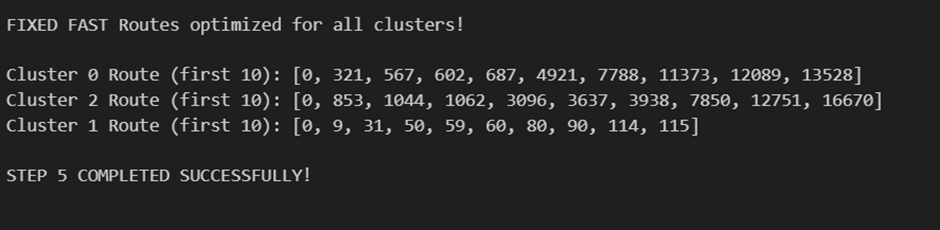
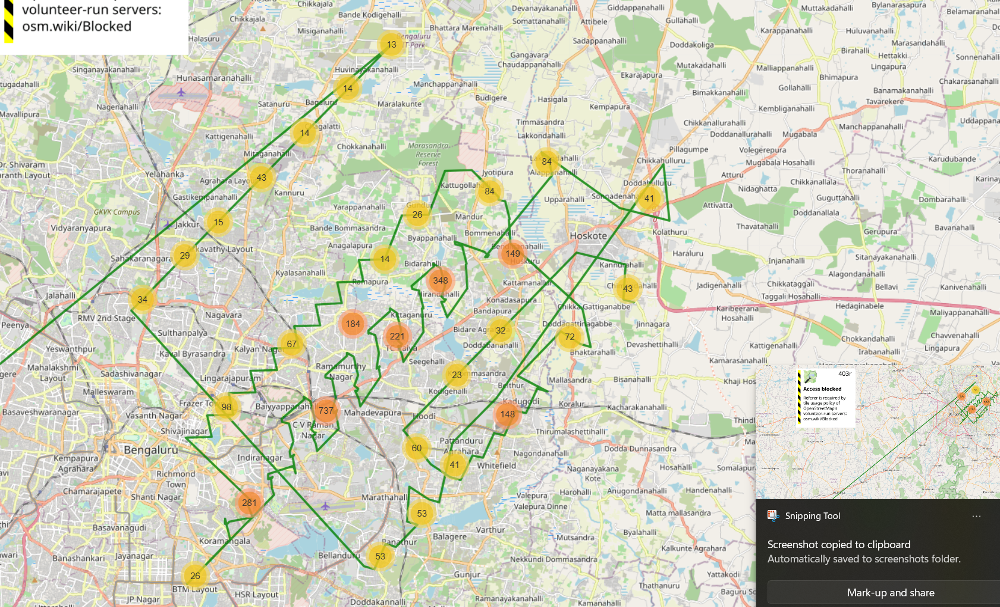

Last Mile Delivery Optimization System

Machine Learning powered system for optimizing last-mile delivery operations with 98.1% prediction accuracy and balanced workload distribution

This project focuses on optimizing last mile delivery operations using machine learning and heuristic-based routing techniques.

It converts raw delivery location data into structured clusters and generates efficient delivery routes for agents, improving overall logistics performance.

The system combines:

K-Means clustering for grouping delivery points
Nearest Neighbour algorithm for route optimization
Geospatial distance calculations for real-world accuracy
Problem Statement

Traditional delivery assignment systems often lead to:

Inefficient routing
Uneven workload distribution
Increased travel time and cost
Poor operational efficiency

This project addresses these challenges by introducing a data-driven optimization approach.

System Workflow
Input Data
↓
Data Preprocessing
↓
K-Means Clustering
↓
Agent Assignment
↓
Nearest Neighbour Routing
↓
Optimized Delivery Plan
Core Techniques Used

K-Means Clustering
Groups nearby delivery locations into clusters based on geographic proximity.

Nearest Neighbour Algorithm
Generates a route by always selecting the closest unvisited location.

Haversine Formula
Calculates accurate distance between latitude and longitude points.

Clustered Delivery Map

Visualization of delivery points grouped into clusters.

Agent-wise Assignment

Each delivery agent is assigned a specific cluster of locations.

Optimized Delivery Route

Route sequence generated using Nearest Neighbour algorithm.

Interactive Map View

Real-time visualization of routes and clusters.

Key Results
Reduced total travel distance
Improved delivery efficiency
Balanced workload among agents
Faster route planning
Scalable system for large datasets
Tech Stack
Python
Pandas, NumPy
Scikit-learn
Folium
Geospatial analysis tools
Why This Approach Works

This system is effective because it:

Reduces routing complexity through clustering
Improves efficiency using greedy optimization
Scales well for large delivery datasets
Mimics real-world logistics decision-making
Future Improvements
Real-time traffic-aware routing
Dynamic clustering for live orders
Reinforcement learning-based optimization
Mobile application for delivery agents
Advanced heuristics like 2-opt or genetic algorithms

Installation
git clone https://github.com/your-username/last-mile-optimization.git
cd last-mile-optimization
pip install -r requirements.txt
python main.py

Conclusion

This project demonstrates how machine learning and heuristic algorithms can be applied to real-world logistics problems to improve efficiency, reduce cost, and optimize delivery operations.
